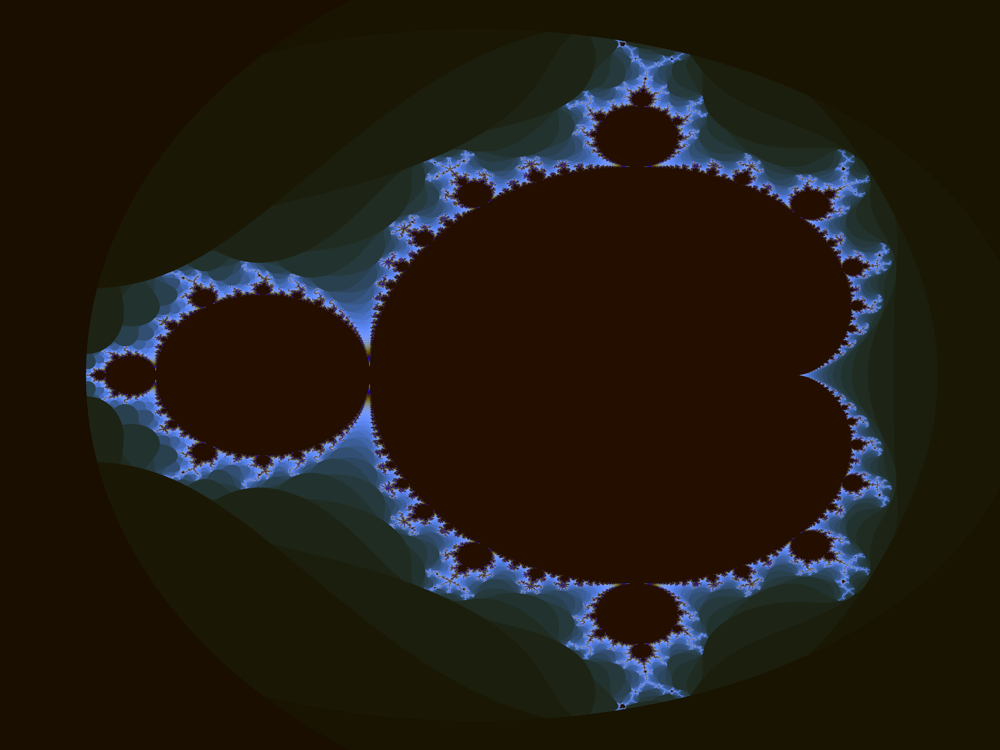

# Vulkan Minimal Compute

This is a fork of [vulkan_minimal_compute](https://github.com/Erkaman/vulkan_minimal_compute) and a simple demo that demonstrates how to use Vulkan for compute operations only.

The application launches a compute shader that renders the mandelbrot set, by rendering it into a storage buffer.
The storage buffer is then read from the GPU, and saved as `.png`. Check the source code comments
for further info.

## Features and limitations

* Vulkan is used to render an image of the Mandelbrot set, using the GPU.
* Very simple, only around 400 LOC
* **The code is heavily commented, so it should be useful for people interested in learning Vulkan**.

## Included dependencies

* LodePNG by Lode Vandevenne

## Sample render

## Requirements

* Vulkan
* Sakemake on ALinux, FreeBSD or macOS w/Homebrew

## Building

The project uses the configuration-free [Sakemake](https://github.com/xyproto/sakemake) build system for building.

If you then run the program, a file named `output.png` should be created. This is a Mandelbrot set that has been rendered by using Vulkan. 

)

